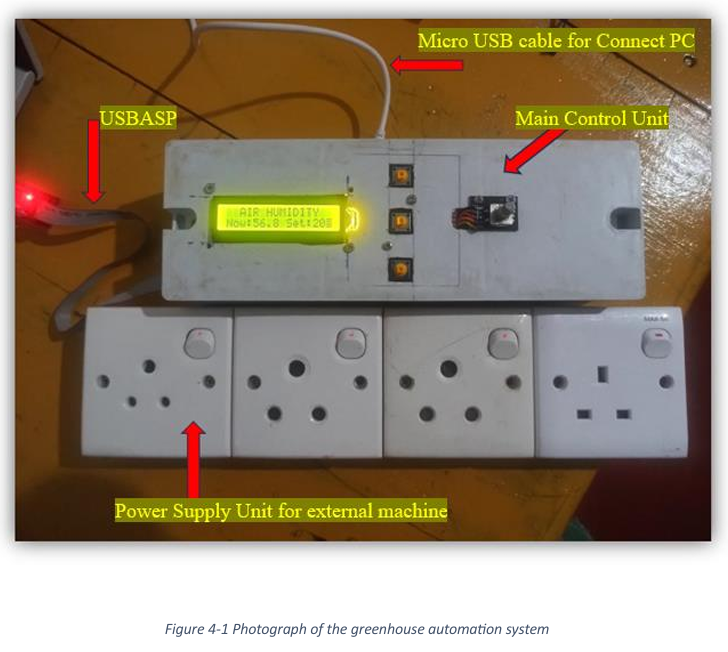
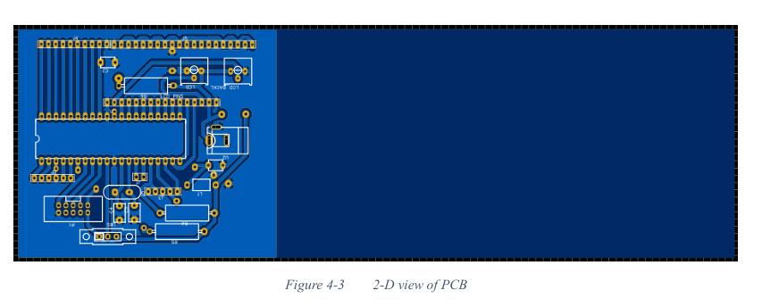

# Smart Agriculture Monitoring and Control System

### This project is not for Agricultural purporses, just for microcontroller and embedded system enthusiast.

## Overview

Welcome to the **Smart Agriculture Monitoring and Control System** repository! This project is a solution designed to monitor and manage various environmental parameters crucial for agriculture. Leveraging the power of microcontrollers, sensors, and cloud connectivity, this system ensures optimal growing conditions by automating the control of essential devices like water pumps and fans.

**Note:** This project is done to understand the low-level behavior of microcontrollers like the ATmega series. Arduino IDE or any widely used libraries aren't used—most of the functionality is hard-coded according to the relavant datasheets of the manufactures.

**Note:** The ESP32 DEVKIT V1 module is only used for send and recive the data to/from firebase cloud database. UART (Universal asynchronous receiver-transmitter) is used as the communication protocol between ESP32and ATMega MCU. There is a special ID mechanism to identify the sensor data accurately without overlapping or malfunctioning.



## Features

- **Real-Time Monitoring:** Tracks temperature, humidity, soil moisture, light intensity, and CO2 levels.
- **Automated Control:** Manages actuators such as heaters, fans, misting systems, and water pumps based on sensor data.
- **User Interaction:** Allows users to set threshold values using a rotary encoder.
- **Cloud Connectivity:** Utilizes an ESP32 DevKit V1 to communicate with Firebase Realtime Database for remote monitoring and data logging.
- **Custom PCB:** Designed a printed circuit board (PCB) for a compact and reliable setup.
- **High Voltage Control:** Features four 230V plug bases to control high-power devices safely.

## Components

### Microcontrollers

- **AVR ATmega32A:** Acts as the main controller managing sensors, actuators, and user inputs.
- **ESP32 DevKit V1:** Handles wireless communication with Firebase Realtime Database for data storage and remote access.

### Sensors

- **Soil Moisture Sensor (PA0):** Measures the moisture level of the soil.
- **Light Sensor (PA1):** Detects the intensity of ambient light.
- **CO2 Sensor (PA2):** Monitors the concentration of CO2 in the environment.
- **DHT22 Sensor (PB4):** Measures temperature and humidity levels.

### Actuators (10 A relays are used)

- **Heater (PA4):** Regulates temperature by providing heating when necessary.
- **Fan (PA5):** Controls airflow to maintain optimal temperature and humidity.
- **Misting System (PA6):** Maintains humidity levels by providing mist.
- **Water Pump (PA7):** Ensures adequate soil moisture by watering plants as needed.

### Additional Components

- **16x2 LCD Display:** Provides real-time data visualization.
- **Rotary Encoder:** Allows users to set threshold values for different parameters.
- **Four 230V Plug Bases:** Safely controls high-voltage devices like water motors and fans.
- **Custom PCB:** Integrates all components into a single, reliable circuit board.

## Schematic and PCB Design

### Schematic Diagram

The schematic diagram illustrates the connections between the ATmega32A microcontroller, sensors, actuators, ESP32 module, and other peripherals.
(EASYEDA platfrom is used)


### PCB Layout

A custom PCB was designed to house all components, ensuring a compact and organized setup. The PCB design files are included in the repository for reference and manufacturing.

.png)


## Getting Started

### Prerequisites

- **Hardware:**

  - AVR ATmega32A Microcontroller
  - ESP32 DevKit V1
  - Sensors: Soil Moisture, Light, CO2, DHT22
  - 16x2 LCD Display
  - Rotary Encoder
  - Custom PCB
  - 4 x 230V Plug Bases

- **Software:**
  - Programmer's Note Pad-AVR GCC Compiler
  - Arduino IDE (for ESP32 programming)
  - Firebase Account

### Installation

1. **Clone the Repository:**
   ```bash
   git clone https://github.com/IndunilThushara/Smart-Agriculture-System.git
   cd Smart_Agriculture_System
   ```

## Setup ATmega8 Microcontroller:

1. **Connect the ATmega32A to your development environment.**
2. **Upload the `main.c` code** located in the `code/` directory using AVR Studio or a similar IDE.

## Configure ESP32 for Firebase:

1. **Open the ESP32 code** in the `esp32/` directory using Arduino IDE.
2. **Install necessary libraries** (e.g., Firebase ESP32 Client).
3. **Update Firebase credentials** in the code.
4. **Upload the code** to the ESP32 DevKit V1.

## Assemble the Hardware:

1. **Connect all sensors** to the ATmega32A as per the schematic.
2. **Attach actuators** to the designated pins on the PCB.
3. **Connect the LCD display and rotary encoder.**
4. **Ensure all high-voltage connections** are secure and insulated.

## Power Up:

1. **Supply appropriate power** to the system.
2. **Monitor the LCD display** for real-time data.
3. **Use the rotary encoder** to set desired thresholds.

## Usage

### Monitoring:

- **View real-time environmental data** on the LCD display.
- Data is also sent to Firebase for remote access and logging.
  .png>)
  .png>)
  .png>)
  .png>)

### Control:

- The system **automatically controls actuators** based on sensor readings and user-defined thresholds.
- **Use the rotary encoder** to navigate through different parameters and adjust settings.

### Remote Access:

- **Access data** through the Firebase Realtime Database dashboard.
- **Implement additional features** like remote control through Firebase.

## Communication with Firebase


The ESP32 DevKit V1 module is programmed to handle wireless communication with Firebase. This allows for:

- **Data Logging:** Sensor data is continuously sent to Firebase for real-time monitoring and historical analysis.
- **Remote Access:** Access sensor data from anywhere using Firebase's web or mobile interfaces.
- **Scalability:** Easily integrate additional features like alerts or remote actuator control.
  

## Safety and High Voltage Control

- **Isolation:** High-voltage components are properly isolated to prevent any accidental short circuits or hazards.
- **Controlled Switching:** The four 230V plug bases are managed through the microcontroller to ensure safe and reliable operation of high-power devices.
- **Compliance:** Ensure all high-voltage connections comply with safety standards and regulations.

## License

This project is licensed under the [MIT License](LICENSE).
